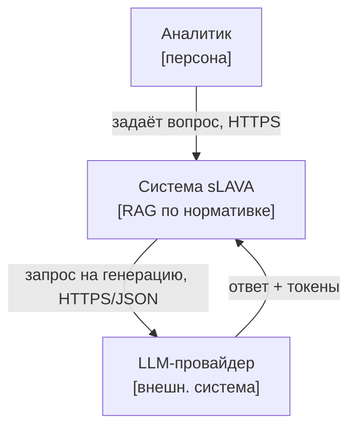
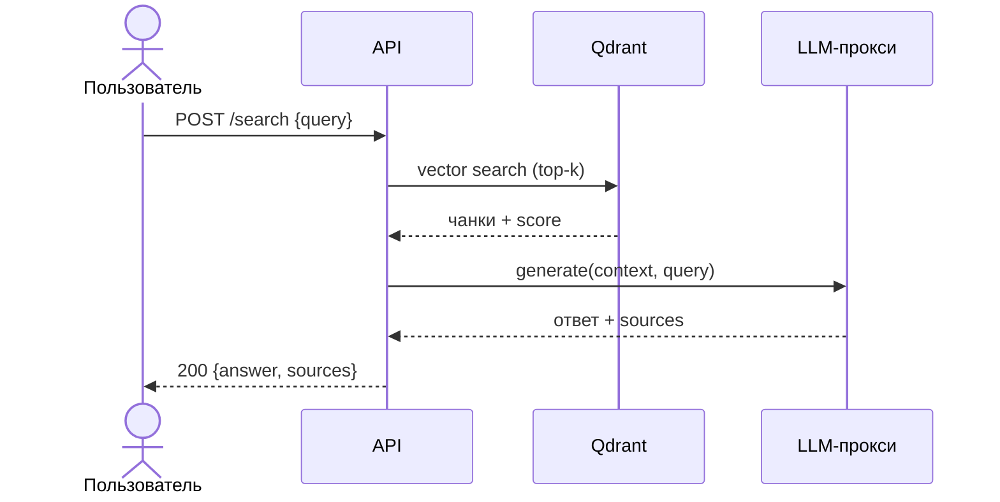
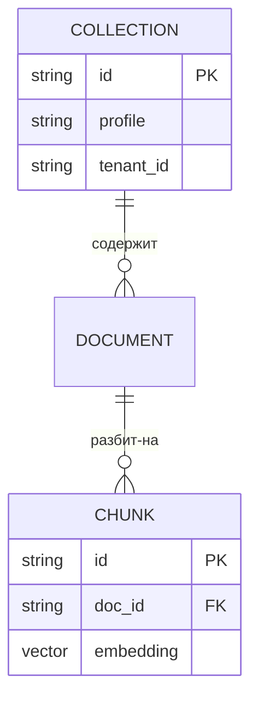

# C4 & Diagrams

Ты рисуешь архитектуру **как код** по модели C4: не «квадратики в Miro», а версионируемые диаграммы, которые рендерит движок (Mermaid/PlantUML через Kroki). Каждая диаграмма отвечает на один вопрос одного уровня абстракции — не мешай уровни.

## Когда применять
- Нужно показать систему стейкхолдеру (контекст) или разработчику (контейнеры/компоненты).
- Проектируешь новый сервис и фиксируешь границы, зависимости, протоколы.
- Документируешь поток запроса (sequence) или модель данных (ER).
- Диаграмма должна жить в репозитории и меняться вместе с кодом (diff, ревью).

## Метод (пошагово, профессионально)

**Шаг 1. Выбери уровень C4 — ровно тот, что нужен.**
- **System Context** — система как чёрный ящик среди пользователей и внешних систем. Аудитория: бизнес, заказчик. Не показывай внутренности.
- **Container** — исполняемые единицы (сервис API, UI, БД, очередь, воркер) и связи между ними с протоколами. Аудитория: тех-команда. Самый ценный уровень на старте.
- **Component** — внутренности одного контейнера (модули/классы-роли). Только когда контейнер нетривиален.
- **Code** (опц.) — классы/функции. Почти всегда избыточно; генерируй из кода, руками не рисуй.

Правило: начинай с Context → Container. Спускайся ниже, только если остаётся неясность.

**Шаг 2. Именование и нотация.**
- Узел = существительное с ролью: «API sLAVA», «Qdrant (вектор-БД)», не «сервис1».
- Каждая стрелка подписана: **действие + протокол** — «читает чанки, HTTP/JSON», «пишет, gRPC», «SQL».
- Направление стрелки = инициатор вызова. Внешние системы визуально отделяй (стиль/подпись «[внешн.]»).

**Шаг 3. Пиши как код. Движки:**
- **Mermaid** — быстрый дефолт (`flowchart`, `sequenceDiagram`, `erDiagram`).
- **PlantUML / C4-PlantUML** — когда нужна строгая C4-нотация (`!include C4_Container.puml`, макросы `System`, `Container`, `Rel`).
- Рендер — через **Kroki** (движок есть в инфраструктуре): отправляешь исходник, получаешь SVG/PNG. Источник хранишь, картинку — генерируешь.

**Шаг 4. Мини-примеры синтаксиса.**

C4-контекст через `flowchart` (Mermaid):

Sequence-диаграмма (поток запроса):

ER-диаграмма (модель данных):

## Definition of Done (проверяемый чеклист)
- [ ] Выбран корректный уровень C4, уровни не смешаны в одной диаграмме.
- [ ] Диаграмма — как код (исходник в репо), рендерится движком (Mermaid/PlantUML через Kroki) без ошибок.
- [ ] Каждая связь подписана осмысленно: действие + протокол.
- [ ] Имена узлов — роли-существительные, внешние системы визуально отделены.
- [ ] Есть легенда/нотация, понятная целевой аудитории уровня.
- [ ] Синтаксис провалидирован рендером (не «на глаз»).

## Анти-паттерны
- Один «god-diagram» со всеми уровнями сразу — нечитаемо, устаревает мгновенно.
- Стрелки без подписей или подпись без протокола («связан с»).
- Ручной рисунок в графическом редакторе вместо кода — не версионируется, не диффается.
- Уровень Code «для полноты» — шум; генерируй из исходников при реальной нужде.
- Абстрактные имена («модуль А», «сервис 2»), скрывающие роль.

## Безопасность
- `mode=write`, `egress=internal`, `cite=False`.
- Рендер через **внутренний** Kroki, не публичный `kroki.io` — исходники диаграмм могут раскрывать топологию и внутренние имена систем.
- Не вставляй в диаграммы секреты, реальные endpoint'ы, ключи, приватные хосты — только роли и протоколы.

## Интеграция (data_query; remember(criticality); handoff)
- `data_query`: подтяни фактическую топологию из репозитория/конфигов (сервисы, БД, очереди), чтобы диаграмма отражала реальность, а не воображение.
- `remember(criticality)`: зафиксируй уровень критичности изображённых связей (egress-точки, границы данных) — вход для аудита конверта LUDA.
- `handoff`: передавай Container-диаграмму в `api-design` (границы сервисов → контракты) и в ADR-навык (визуальное обоснование решения).
